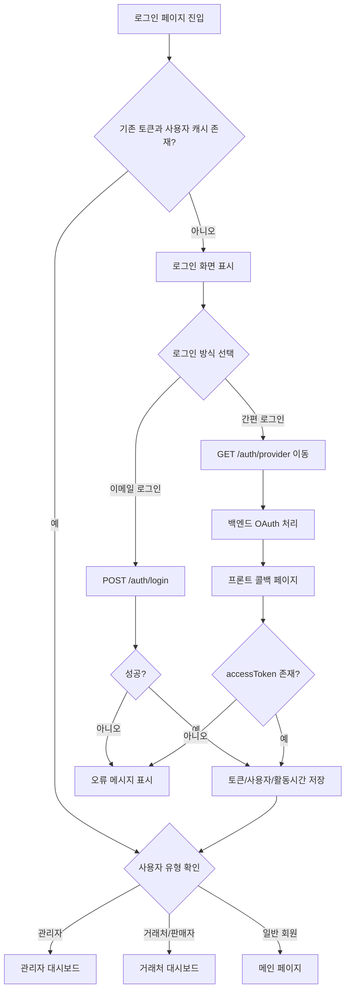

# MEATMALL 로그인/간편 로그인 로직 인수인계서

작성일: 2026-07-23  
대상: MEATMALL 현재 로그인 페이지 로직 분석 및 MEATOS/SCM 적용 설계  
범위: `login.html`, `js/app.js`, `js/api.js`, `pages/social-callback.html`, `pages/link-account.html`

---

## 1. 문서 목적

현재 MEATMALL에 구현된 로그인 및 간편 로그인 흐름을 MEATOS 같은 SCM/관리형 앱에 재사용하기 위해, 화면 디자인이 아닌 "프로세스와 로직"만 정리한다.

MEATMALL은 현재 개인 회원 쇼핑몰 구조를 기준으로 되어 있으나, 핵심 로그인 구조는 다음과 같이 SCM 앱에도 그대로 이전 가능하다.

- 이메일/비밀번호 로그인
- Google/Kakao/Naver 간편 로그인 시작
- 백엔드 OAuth 인증 처리
- 프론트 콜백 페이지에서 토큰 저장
- 사용자 유형에 따른 화면 이동
- 세션 만료 처리
- 중복 계정 연결 처리

---

## 2. 현재 로그인 구성 파일

| 파일 | 역할 |
|---|---|
| `meatmall/login.html` | 로그인 화면, 이메일 로그인, 간편 로그인 버튼, 로그인 성공 후 라우팅 |
| `meatmall/js/app.js` | 전역 세션 만료 처리, 사용자 캐시, 장바구니 사용자 분리 |
| `meatmall/js/api.js` | API 호출 공통 처리, 토큰 갱신, 401 처리, Auth API |
| `meatmall/pages/social-callback.html` | 간편 로그인 성공 후 토큰 저장 및 최종 이동 |
| `meatmall/pages/link-account.html` | 이미 가입된 이메일과 소셜 계정 연결 처리 |

---

## 3. 현재 인증 서버 구조

현재 프론트에서 사용하는 인증 API 기본 주소는 다음이다.

```txt
https://api.meatbonga.com/api
```

주요 인증 엔드포인트는 아래 구조로 설계되어 있다.

| 기능 | Method | Endpoint |
|---|---:|---|
| 이메일 로그인 | POST | `/auth/login` |
| Google 로그인 시작 | GET | `/auth/google` |
| Kakao 로그인 시작 | GET | `/auth/kakao` |
| Naver 로그인 시작 | GET | `/auth/naver` |
| 토큰 갱신 | POST | `/auth/refresh` |
| 로그아웃 | POST | `/auth/logout` |
| 계정 연결 비밀번호 확인 | POST | `/auth/relink/verify-password` |

---

## 4. 이메일 로그인 흐름

### 4.1 사용자 입력

로그인 페이지에서 사용자는 다음 값을 입력한다.

- 이메일
- 비밀번호

현재 기본 예시 계정은 다음처럼 화면에 들어가 있다.

```txt
admin@meatmall.co.kr
```

### 4.2 프론트 검증

`login.html`의 `doLogin()` 함수는 입력값이 없으면 즉시 중단한다.

```js
if (!email || !pw) {
  alert('이메일과 비밀번호를 입력해주세요.');
  return;
}
```

### 4.3 서버 요청

로그인 요청은 아래 형식으로 전송된다.

```http
POST /auth/login
Content-Type: application/json
credentials: include
```

요청 Body:

```json
{
  "email": "admin@meatmall.co.kr",
  "password": "사용자 입력 비밀번호"
}
```

### 4.4 재시도 로직

현재 로그인 페이지는 서버 콜드 스타트나 일시적인 네트워크 오류를 고려해 최대 4회 재시도한다.

- 2xx: 성공 처리
- 4xx: 사용자 입력 또는 인증 오류로 판단하고 즉시 중단
- 5xx/네트워크 오류: 일정 시간 후 재시도

### 4.5 성공 응답 처리

로그인 성공 시 서버 응답에서 다음 값을 사용한다.

```json
{
  "accessToken": "JWT_ACCESS_TOKEN",
  "user": {
    "id": "user-id",
    "email": "user@example.com",
    "name": "사용자명",
    "is_admin": false,
    "vendor_id": null
  }
}
```

프론트는 성공 후 아래 값을 브라우저 저장소에 저장한다.

| Key | 설명 |
|---|---|
| `mm_access_token` | API 인증용 Access Token |
| `mm_user_cache` | 사용자 기본 정보 캐시 |
| `mm_last_active` | 마지막 활동 시간 |
| `mm_admin` | 관리자 여부 세션 플래그 |

### 4.6 로그인 후 이동

현재 이동 규칙은 다음과 같다.

| 조건 | 이동 페이지 |
|---|---|
| `user.is_admin === true` | `admin/dashboard.html` |
| `user.vendor_id` 존재 | `vendor/dashboard.html` |
| 일반 회원 | `index.html` |

---

## 5. 간편 로그인 흐름

현재 로그인 페이지에는 다음 간편 로그인 버튼이 있다.

- Google
- Kakao
- Naver
- Apple, 현재 비활성 또는 준비 상태

### 5.1 간편 로그인 시작

사용자가 간편 로그인 버튼을 누르면 프론트는 직접 인증을 처리하지 않고 백엔드 인증 시작 URL로 이동한다.

```js
window.location.href = API + '/auth/' + provider;
```

예:

```txt
https://api.meatbonga.com/api/auth/google
https://api.meatbonga.com/api/auth/kakao
https://api.meatbonga.com/api/auth/naver
```

### 5.2 백엔드 역할

백엔드는 각 소셜 플랫폼과 OAuth 인증을 처리한다.

프론트는 OAuth Client Secret, Provider Token 교환, 사용자 프로필 검증을 직접 하지 않는다.

백엔드에서 처리해야 하는 항목은 다음과 같다.

- Provider 로그인 페이지로 리다이렉트
- Authorization Code 수신
- Access Token 교환
- Provider 사용자 프로필 조회
- 기존 계정 존재 여부 확인
- 신규 계정 생성 또는 기존 계정 연결
- MEATMALL 자체 Access Token 발급
- 프론트 콜백 페이지로 리다이렉트

### 5.3 프론트 콜백 처리

간편 로그인 성공 후 백엔드는 프론트의 콜백 페이지로 이동시킨다.

현재 콜백 페이지:

```txt
meatmall/pages/social-callback.html
```

콜백 페이지는 URL Query Parameter에서 다음 값을 읽는다.

| Parameter | 설명 |
|---|---|
| `accessToken` | MEATMALL API용 Access Token |
| `refreshToken` | Refresh Token, 있는 경우 저장 |
| `needsPhone` | 휴대폰 인증 필요 여부 |
| `vendor` | 판매자/거래처 계정 여부 |
| `error` | 인증 실패 코드 |

### 5.4 콜백 저장 로직

콜백 페이지는 `accessToken`이 있으면 아래 값을 저장한다.

```js
localStorage.setItem('accessToken', accessToken);
localStorage.setItem('mm_access_token', accessToken);
localStorage.setItem('mm_last_active', String(Date.now()));
```

`refreshToken`이 있으면 추가 저장한다.

```js
localStorage.setItem('refreshToken', refreshToken);
```

### 5.5 콜백 후 이동

간편 로그인 성공 후 이동 규칙은 다음과 같다.

| 조건 | 이동 페이지 |
|---|---|
| `needsPhone === true` | `pages/phone-verify.html` |
| `vendor === 1` | `vendor/dashboard.html` |
| 일반 회원 | `index.html` |

---

## 6. 토큰 갱신 및 API 인증 흐름

`js/api.js`는 API 요청 공통 함수인 `apiFetch()`를 통해 인증 처리를 수행한다.

### 6.1 API 요청 시 인증 헤더

메모리에 Access Token이 있으면 API 요청에 다음 헤더를 붙인다.

```http
Authorization: Bearer {accessToken}
```

또한 모든 인증 관련 요청에는 쿠키 포함 옵션을 사용한다.

```js
credentials: 'include'
```

### 6.2 401 응답 처리

API 응답이 401이면 프론트는 즉시 로그아웃하지 않고 먼저 토큰 갱신을 시도한다.

```txt
API 요청
→ 401 Unauthorized
→ /auth/refresh 요청
→ 새 accessToken 발급 성공
→ 원래 API 요청 재시도
```

### 6.3 토큰 갱신 실패

토큰 갱신에 실패하면 아래 값들을 삭제한다.

- `mm_access_token`
- `mm_token`
- `mm_user_cache`
- `mm_last_active`

그 후 로그인 페이지로 이동한다.

---

## 7. 세션 만료 처리

`js/app.js`에는 사용자의 마지막 활동 시간을 기준으로 자동 로그아웃하는 로직이 있다.

현재 기준:

```txt
10분 미활동 시 자동 로그아웃
```

설정값:

```js
IDLE_MS = 10 * 60 * 1000
```

### 7.1 감지 이벤트

다음 사용자 활동이 발생하면 `mm_last_active`가 현재 시간으로 갱신된다.

- 클릭
- 키 입력
- 마우스 이동
- 터치
- 스크롤

### 7.2 만료 시 처리

마지막 활동 시간이 10분을 초과하면 세션 값을 삭제하고 로그인 페이지로 이동한다.

---

## 8. 중복 계정 연결 로직

`pages/link-account.html`은 소셜 로그인 시 이미 같은 이메일로 가입된 계정이 있을 때 사용하는 계정 연결 화면이다.

### 8.1 Query Parameter

| Parameter | 설명 |
|---|---|
| `token` | 계정 연결용 임시 토큰 |
| `email` | 기존 가입 이메일 |
| `reauthMethod` | 재인증 방식 |
| `newProvider` | 새로 연결하려는 소셜 Provider |

### 8.2 비밀번호 재확인 방식

기존 계정이 이메일/비밀번호 기반이면 사용자가 비밀번호를 입력한다.

요청:

```http
POST /auth/relink/verify-password
```

요청 Body:

```json
{
  "token": "임시 연결 토큰",
  "password": "사용자 입력 비밀번호"
}
```

성공 시 Access Token과 사용자 정보를 저장하고 서비스 화면으로 이동한다.

### 8.3 소셜 재인증 방식

기존 계정도 소셜 계정이면 해당 Provider로 다시 이동한다.

```txt
/auth/{reauthMethod}?relink={token}
```

---

## 9. 현재 로그인 전체 프로세스



---

## 10. MEATOS/SCM 적용 방향

MEATOS는 쇼핑몰 개인 회원 중심이 아니라 SCM/ERP형 관리 앱이므로, 로그인 로직은 유지하되 사용자 모델과 라우팅 정책을 변경해야 한다.

### 10.1 사용자 유형 변환

MEATMALL 현재 구조:

```txt
일반 회원
관리자
판매자/거래처
```

MEATOS 권장 구조:

```txt
본사 관리자
구매 담당자
자재 담당자
생산 담당자
품질 담당자
입고/출고 담당자
거래처 담당자
외부 협력사
읽기 전용 감사/조회 계정
```

### 10.2 사용자 데이터 권장 필드

MEATOS에서는 로그인 성공 응답의 `user` 객체를 아래처럼 확장하는 것이 좋다.

```ts
type MeatosLoginUser = {
  id: string;
  email: string;
  name: string;
  role: 'super_admin' | 'admin' | 'manager' | 'operator' | 'partner' | 'viewer';
  company_id: string;
  vendor_id?: string;
  department_id?: string;
  permission_group: string;
  is_admin: boolean;
  status: 'active' | 'pending' | 'blocked';
  needs_mfa?: boolean;
  needs_profile_setup?: boolean;
};
```

### 10.3 라우팅 변환

MEATMALL 현재 이동 규칙을 MEATOS에서는 다음처럼 바꾸는 것이 적합하다.

| 현재 MEATMALL 조건 | MEATOS 적용 조건 | 이동 페이지 |
|---|---|---|
| `is_admin` | `role === super_admin/admin` | `/admin/dashboard` |
| `vendor_id` | 외부 협력사/거래처 계정 | `/partner/dashboard` |
| 일반 회원 | 내부 실무자 | `/scm/dashboard` |
| `needsPhone` | 추가 인증 또는 MFA 필요 | `/auth/verify` |
| 계정 연결 필요 | SSO 계정 연결 필요 | `/auth/link-account` |

---

## 11. MEATOS 적용 시 권장 인증 흐름

### 11.1 이메일 로그인

```txt
1. 사용자가 이메일/비밀번호 입력
2. POST /auth/login
3. 서버가 사용자 상태 확인
   - active 여부
   - 회사/거래처 소속 여부
   - 권한 그룹 여부
   - MFA 필요 여부
4. Access Token 발급
5. Refresh Token은 HttpOnly Cookie로 저장 권장
6. 프론트는 사용자 정보와 마지막 활동 시간 저장
7. role/company_id/vendor_id 기준으로 대시보드 이동
```

### 11.2 간편 로그인/SSO

```txt
1. 사용자가 Google/Kakao/Naver 또는 기업 SSO 클릭
2. 프론트가 /auth/{provider}로 이동
3. 백엔드가 Provider OAuth 처리
4. 백엔드가 이메일 도메인, 회사, 권한 상태 검증
5. 계정이 없으면 승인 대기 또는 초대 기반 가입 처리
6. 계정이 있으면 자체 Access Token 발급
7. social-callback 페이지에서 토큰 저장
8. role 기준으로 SCM 대시보드 이동
```

---

## 12. MEATOS에서 유지할 로직

현재 MEATMALL 로직 중 MEATOS에 그대로 가져갈 수 있는 부분은 다음이다.

| 로직 | 재사용 여부 | 비고 |
|---|---:|---|
| 프론트에서 OAuth 직접 처리하지 않고 백엔드로 위임 | 사용 | 보안상 적합 |
| `/auth/{provider}`로 간편 로그인 시작 | 사용 | Provider만 확장 가능 |
| 콜백 페이지에서 토큰 저장 후 라우팅 | 사용 | Query 대신 fragment 또는 code 방식도 가능 |
| Access Token 기반 API 호출 | 사용 | 만료 시간은 짧게 유지 권장 |
| 401 발생 시 refresh 후 재요청 | 사용 | SCM 필수 |
| 마지막 활동 시간 기반 자동 로그아웃 | 사용 | 시간은 업무 환경에 맞게 조정 |
| 중복 계정 연결 | 사용 | SSO/초대 계정 연결에 유용 |
| 사용자 유형별 대시보드 이동 | 사용 | role/permission 기반으로 확장 |

---

## 13. MEATOS에서 수정해야 할 부분

### 13.1 저장소 Key 이름

현재 MEATMALL Key:

```txt
mm_access_token
mm_user_cache
mm_last_active
mm_admin
```

MEATOS 권장 Key:

```txt
meatos_access_token
meatos_user_cache
meatos_last_active
meatos_admin
```

MEATMALL과 MEATOS가 같은 브라우저에서 함께 사용될 수 있으므로 저장소 Key 충돌을 피하는 것이 좋다.

### 13.2 Refresh Token 저장 방식

현재 콜백 페이지는 `refreshToken`이 있으면 LocalStorage에 저장한다.

SCM/ERP에서는 보안 수준을 높이기 위해 다음 방식을 권장한다.

```txt
Refresh Token: HttpOnly + Secure + SameSite Cookie
Access Token: 짧은 만료 시간
권한 검증: 프론트 캐시가 아니라 서버 기준
```

### 13.3 로그인 성공 후 사용자 검증

현재는 사용자 캐시만 있어도 로그인된 것으로 보는 로직이 일부 존재한다.

SCM에서는 반드시 서버 확인을 추가해야 한다.

권장:

```txt
앱 시작
→ accessToken 또는 refresh cookie 확인
→ GET /auth/me
→ 서버가 사용자 상태/권한 반환
→ 유효할 때만 화면 진입
```

### 13.4 세션 만료 시간

현재는 10분 미활동 로그아웃이다.

MEATOS 권장:

| 계정 유형 | 권장 세션 |
|---|---:|
| 관리자 | 15~30분 |
| 내부 실무자 | 30~60분 |
| 외부 협력사 | 15~30분 |
| 현장 태블릿 계정 | 별도 정책 필요 |

---

## 14. MEATOS 로그인 모듈 권장 구조

```txt
src/
  auth/
    AuthProvider.tsx
    auth.service.ts
    auth.storage.ts
    auth.types.ts
    routeGuard.ts
  pages/
    LoginPage.tsx
    SocialCallbackPage.tsx
    LinkAccountPage.tsx
    VerifyPage.tsx
```

### 14.1 역할 분리

| 모듈 | 역할 |
|---|---|
| `auth.service.ts` | 로그인, 로그아웃, 토큰 갱신, 내 정보 조회 |
| `auth.storage.ts` | 토큰/사용자 캐시 저장소 관리 |
| `AuthProvider.tsx` | 앱 전역 인증 상태 제공 |
| `routeGuard.ts` | 역할/권한별 접근 제어 |
| `SocialCallbackPage.tsx` | OAuth 완료 후 토큰 저장 및 이동 |
| `LinkAccountPage.tsx` | 기존 계정과 SSO 연결 |

---

## 15. MEATOS 권장 API 계약

### 15.1 로그인

```http
POST /auth/login
```

Request:

```json
{
  "email": "manager@company.com",
  "password": "password"
}
```

Response:

```json
{
  "accessToken": "access-token",
  "user": {
    "id": "u_001",
    "email": "manager@company.com",
    "name": "홍길동",
    "role": "manager",
    "company_id": "c_001",
    "department_id": "purchase",
    "permission_group": "purchase_manager",
    "is_admin": false,
    "status": "active"
  }
}
```

### 15.2 내 정보 조회

```http
GET /auth/me
Authorization: Bearer {accessToken}
```

Response:

```json
{
  "user": {
    "id": "u_001",
    "email": "manager@company.com",
    "name": "홍길동",
    "role": "manager",
    "company_id": "c_001",
    "department_id": "purchase",
    "permission_group": "purchase_manager",
    "status": "active"
  },
  "permissions": [
    "purchase.read",
    "purchase.write",
    "vendor.read"
  ]
}
```

### 15.3 토큰 갱신

```http
POST /auth/refresh
credentials: include
```

Response:

```json
{
  "accessToken": "new-access-token",
  "user": {
    "id": "u_001",
    "role": "manager",
    "company_id": "c_001"
  }
}
```

---

## 16. 현재 구현상 주의할 점

MEATMALL 현재 구현에서 MEATOS로 옮길 때 반드시 정리해야 할 부분이다.

### 16.1 로그인 Host 중복

현재 `login.html`에는 로그인 서버 배열이 있으나 같은 주소가 중복되어 있다.

```js
const LOGIN_HOSTS = [
  'https://api.meatbonga.com/api',
  'https://api.meatbonga.com/api'
];
```

MEATOS에서는 실제 운영 API와 예비 API가 다를 때만 fallback 구조를 유지한다.

### 16.2 사용자 캐시만으로 로그인 판단 금지

일부 로직은 `mm_user_cache`만 있어도 로그인 상태로 판단할 수 있다.

SCM에서는 사용자 캐시를 화면 표시용으로만 사용하고, 접근 권한은 반드시 서버에서 확인해야 한다.

### 16.3 토큰 Key 통일

현재 간편 로그인 콜백은 `accessToken`과 `mm_access_token`을 동시에 저장한다.

MEATOS에서는 하나의 표준 Key만 사용한다.

권장:

```txt
meatos_access_token
```

### 16.4 개인 회원 인증 문구 제거

MEATOS에서는 다음 쇼핑몰용 개념을 제거하거나 업무용 용어로 변경한다.

| MEATMALL | MEATOS |
|---|---|
| 회원가입 | 계정 신청 / 초대 수락 |
| 휴대폰 인증 | MFA / 관리자 승인 |
| 일반 회원 | 내부 사용자 |
| 판매자 | 협력사 / 거래처 |
| 마이페이지 | 내 계정 / 프로필 |

---

## 17. MEATOS 적용 체크리스트

- [ ] 로그인 API 주소를 MEATOS API 주소로 변경
- [ ] 저장소 Key를 `meatos_*` 기준으로 변경
- [ ] `user.role`, `company_id`, `permission_group` 기반 라우팅 적용
- [ ] `/auth/me` 기반 앱 시작 검증 추가
- [ ] Refresh Token은 HttpOnly Cookie 방식 적용
- [ ] 간편 로그인 Provider별 Redirect URI 등록
- [ ] 초대되지 않은 외부 계정 로그인 차단
- [ ] 퇴사자/차단 계정 로그인 차단
- [ ] 관리자/협력사/현장 계정별 세션 정책 분리
- [ ] 계정 연결 화면을 SSO 연결 화면으로 변경
- [ ] 로그인 실패 메시지는 보안상 상세 원인 노출 최소화
- [ ] 로그인/로그아웃/토큰 갱신 로그를 감사 로그로 저장

---

## 18. 결론

MEATMALL의 현재 간편 로그인 구조는 SCM 앱에서도 사용할 수 있는 표준적인 구조다.

핵심은 다음 4가지를 유지하는 것이다.

```txt
1. 프론트는 OAuth를 직접 처리하지 않고 백엔드 /auth/{provider}로 위임한다.
2. 백엔드는 Provider 인증 후 자체 Access Token을 발급한다.
3. 프론트 콜백 페이지는 토큰과 사용자 상태를 저장한 뒤 역할별 화면으로 이동한다.
4. 이후 API 요청은 Access Token + Refresh Token 갱신 구조로 유지한다.
```

MEATOS에서는 개인 회원 중심의 화면 문구와 라우팅만 SCM 권한 체계로 바꾸면 된다.

즉, 현재 로직의 골격은 유지하고 사용자 모델을 `회원`에서 `회사/부서/권한/협력사` 중심으로 확장하는 방식이 가장 안정적이다.
